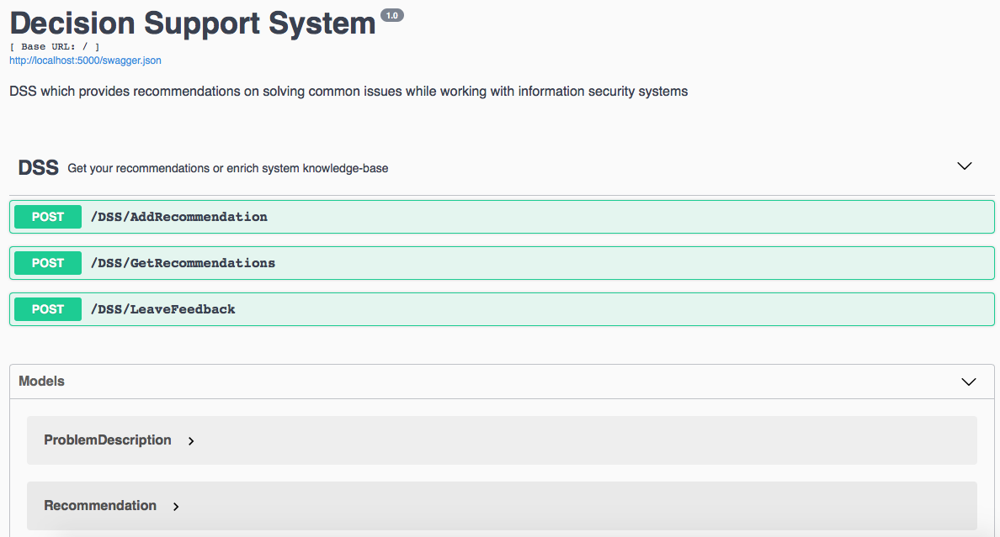

# Decision Support System

Basic structure implemented. There're three API methods:
1. /GetRecommendation: gets problem description in log or stdout text format
and returns recommendations sorted by relevance (rating).  
2. /RateRecommendation: gets problem, recommendation and "did helped" flag
and tunes problem->recommendation rating (compliance rate).  
3. /AddRecommendation: gets recommendation and saves it to knowledge base.  

API documentation is powered by OpenAPI Swagger.  

docker-compose start 3 container
1. nginx
2. elastic
3. app

Flask app start with 30 sec delay for completely start elasticsearch.
Without delay elasticsearch not started properly and flask app crash with multiple errors.

